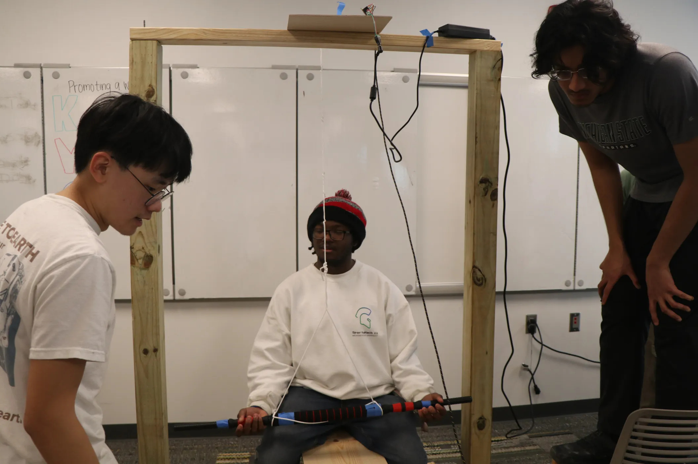
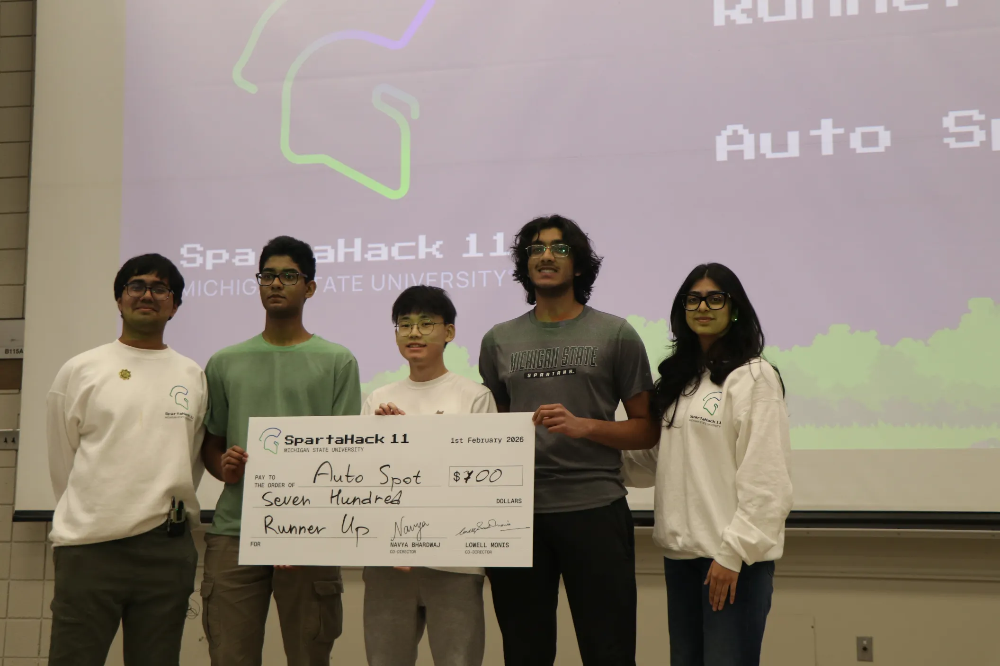

# Auto Spot
Fully autonomous bench press spotting system. Using computer vision algorithms that power a motor, you can solo lift safe and without danger.

Check out our [DevPost](https://devpost.com/software/otto-spot) entry for this project!

# Demo & Photos
https://youtu.be/bXroXM2SEfQ
Click below to watch the video demo!

 

# The Team
Made by Seungwon (Josh) Hong, Bharatraj Elavarasan, Hitesh Tirumalasetti.

Awarded "All Tracks Runner-up" at SpartaHack 11, coming 2nd place overall out of 106 projects. February 1st 2026
